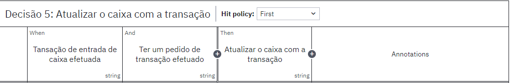

# Atividades Ponderadas
## Módulo 7 - SAP
### Ana Carolina Cremonezi Martire

### Índice
  - [Semana 3 - Regras de Negócio de DMN](#Regras-de-Negócio-e-DMN)
  - [Semana 5 - Plano de Cutover](#Plano-de-Cutover)

 

#### Semana 3
##### Regras de Negócio e DMN

&emsp;&emsp;De acordo com a Allura, "Uma regra (de negócio) define uma diretriz para cada contexto específico de um negócio, sobre qual deve ser o resultado esperado para cada ação ou decisão." Ela traduz uma necessidade do negócio em regras lógicas, fazendo com que o desenvolvimento de uma empresa se alinhe com essas necessidades.

&emsp;&emsp;Seguindo essa definição, cada integrante do grupo G2² desenvolveu 5 diferentes Regras de Negócio que se encaixam no projeto do Inteli. As regras que eu desenvolvi foram as seguintes:

 

Tabela 1 - Regras de Negócio - Time Financeiro

| Número | Descrição | Critérios de Aplicação | Ações | Responsável |
| ------ | ------ | ------ | ------ | ------ |
**FI001** | Pedido de transação for recebido de saída de caixa. | Ter um pedido de transação recebido. | Verificar se há orçamento disponível para a área solicitante. | Equipe Financeira. | 
**FI002** | Pedido de transação for recebido de entrada de caixa. | Ter um pedido de transação recebido. | Verificar se a transação ocorreu. | Equipe Financeira. |
**FI003** | Falta de orçamento na área que pediu uma transação. | Não ter orçamento. | Informar a área que o pedido foi recusado. | Equipe Financeira. |
**FI004** | Tansação de entrada de caixa efetuada. | Ter um pedido de transação efetuado. | Atualizar o caixa com a transação. | Equipe Financeira. |
**FI005** |  Transação for uma entrada de caixa não efetuada. | Ter um pedido de transação não efetuado. | Adicionar a previsão ao caixa. | Equipe Financeira. |

Fonte: Material produzido pelos autores (2024)

 

&emsp;&emsp;Após ter pensado e criado a tabela de Regras de Negócio acima, foi necessário desenvolver um diagrama DMN (Decision Model Notation).

Figura 1 - Diagrama DMN

Fonte: Material produzido pelos autores (2024)

 

&emsp;&emsp;Dentro das Decisões 1, 3, 4, 5 e 6 há uma "*decision table*", onde estão inseridas as Regras de Negócio já estipuladas. Elas podem ser vistas nas imagens a seguir.
 
 

Figura 2 - Diagrama DMN - Decision Table 1

Fonte: Material produzido pelos autores (2024)

 

&emsp;&emsp;Na figura acima, pode-se ver a tabela de decisão da decisão 1. Ela tem relação direta com a Regra de Negócio de nomenclatura FI001.

 
 

Figura 3 - Diagrama DMN - Decision Table 3

Fonte: Material produzido pelos autores (2024)

 

&emsp;&emsp;Na figura apresentada acima, é possível observar a tabela de decisão referente à decisão 3, que está diretamente relacionada à Regra de Negócio de nomenclatura FI002.

 
 

Figura 4 - Diagrama DMN - Decision Table 4

Fonte: Material produzido pelos autores (2024)

 

&emsp;&emsp;A imagem acima refere-se à tabela de decisão correspondente à decisão 4, que está diretamente vinculada à Regra de Negócio FI003.

 
 

Figura 5 - Diagrama DMN - Decision Table 5

Fonte: Material produzido pelos autores (2024)

 

&emsp;&emsp;Na figura 5, pode-se visualizar a tabela de decisão da decisão 5: atualizar o caixa da transação. Ela tem relação direta com a Regra de Negócio de nomenclatura FI004.

 
 

Figura 6 - Diagrama DMN - Decision Table 6

Fonte: Material produzido pelos autores (2024)

 

&emsp;&emsp;Por fim, na figura acima, está a tabela de decisão da decisão 6, cuja qual tem relação direta com a Regra de Negócio de nome FI005.

 
 

#### Semana 5
##### Plano de Cutover

&emsp;&emsp;Um Plano de Cutover é o conjunto de atividades detalhadas que uma empresa segue para fazer a transição de um sistema antigo para um novo sistema, geralmente um ERP. O objetivo do cutover é garantir que a troca de sistemas ocorra de forma suave e sem grandes impactos nas operações do negócio.

&emsp;&emsp;Um exemplo de Plano de Cutover**¹** pode ser encontrado na implementação de um novo ERP na empresa *Schlumberger*, conforme descrito em um documento publicado pela *Scrum Inc.*. O projeto consistiu na transição de um sistema antigo para um novo ERP, com a utilização da metodologia Scrum para coordenar as fases de planejamento e execução. Esse tipo de implementação é complexo e requer uma preparação detalhada para garantir que a migração de dados, a infraestrutura, e os usuários estejam prontos para o go-live. 

&emsp;&emsp;Os principais elementos do Plano de Cutover incluíram a preparação detalhada para garantir que todas as áreas envolvidas estivessem prontas para a migração. O projeto envolveu a validação e transferência de dados do sistema antigo para o novo ERP, além de um forte foco em treinamento dos usuários, para garantir que todos soubessem operar o novo sistema de forma eficiente. Além disso, houve a integração de infraestrutura, incluindo dispositivos e sistemas periféricos necessários para a operação contínua da empresa. Por fim, o projeto incluiu um monitoramento pós-go-live, que permitiu a identificação rápida de problemas e correções, garantindo a estabilidade do sistema.

&emsp;&emsp;Os pontos positivos deste plano incluíram a preparação minuciosa, que foi essencial para uma transição tranquila, o treinamento extensivo dos usuários, que reduziu significativamente os erros operacionais no novo sistema, e a flexibilidade da metodologia Scrum, que possibilitou ajustes rápidos durante a execução do projeto. Por outro lado, os pontos negativos envolveram os custos elevados associados à preparação e ajustes, e a complexidade de integrar sistemas periféricos, que demandaram tempo e recursos adicionais para garantir o sucesso da migração.

 

#### Semana 6
##### Diagrama de Entidade e Relacionamento

&emsp;&emsp;Um Diagrama de Entidade-Relacionamento (DER) é uma representação visual que descreve como diferentes entidades em um banco de dados se relacionam entre si. Cada entidade, que pode representar uma tabela em um banco de dados, é mostrada como um retângulo contendo seus atributos, como chaves primárias e outros campos importantes. As conexões entre essas entidades, chamadas de relacionamentos, são representadas por losangos ou linhas que ligam as entidades e podem descrever como elas interagem, por exemplo, se uma entidade está associada a outra em uma relação de **um para um** (1:1), **um para muitos** (1:N), ou **muitos para muitos** (N:N).

&emsp;&emsp;Para a atividade ponderada, foi necessário desenvolver um DER para as 4 tabelas que a G2 Tecnologia nos enviou no começo do módulo. Essas tabelas são:

- **OCRB** -- possui os dados bancários dos PNs
- **OCRD** -- possui informações sobre os PNs
- **CRD1** -- possui os endereços dos PNs
- **CRD7** -- possui informações fiscais dos PNs

&emsp;&emsp;O DER de cada tabela (contendo, também, suas ligações) foi desenvolvido em dois programas diferentes: *draw.io* e *SQL Designer*. A versão no *SQL Designer* está em formato `.xml` na pasta `documents` desse repositório, com o nome "AtividadePonderada_S6.xml". Já a versão no *draw.io*, que é exatamente igual, pode ser vista na imagem abaixo.

Figura 7 - DER - Tabelas OCRB, OCRD, CRD1 e CRD7

Fonte: Material produzido pelos autores (2024)

 

&emsp;&emsp;A tabela OCRB é o ponto central do DER, pois todas as outras tabelas se conectam a ela por meio de chaves estrangeiras (ou *Foreign Keys*). Cada tabela que armazena informações complementares sobre os parceiros de negócios (PNs), como endereços, informações fiscais e detalhes dos PNs, se relaciona diretamente com a OCRB. A chave primária de OCRB é `CardCode`, que também funciona como chave estrangeira nas demais tabelas, estabelecendo as relações entre as contas bancárias e os dados adicionais dos parceiros.

&emsp;&emsp;A tabela OCRD está ligada à OCRB por meio de `CardCode`, seguindo uma relação de **1:N**, onde um parceiro pode ter várias contas bancárias.

&emsp;&emsp;A tabela CRD1 está ligada à OCRB por meio de `CardCode`, seguindo uma relação de **1:N**, onde uma conta bancária pode estar associada a vários endereços. Isso permite que uma única conta bancária tenha múltiplos locais de correspondência ou operação, como escritórios e filiais de um parceiro de negócios.

&emsp;&emsp;A tabela CRD7 (informações fiscais dos PNs) também está ligada à OCRB por meio de `CardCode`, e também em uma relação de **1:N**, onde uma conta bancária pode ter várias informações fiscais associadas. Isso é útil para armazenar diferentes números de identificação fiscal ou dados regulamentares vinculados a uma única conta bancária.

&emsp;&emsp;É importante notar, que nas tabelas CRD1 e CRD7 foi necessário adicionar novas colunas, sendo elas `Id_CDR1`para a primeira tabela, e `Id_CDR7`para a segunda. Isso se deve ao fato de que não seria possível criar uma chave primária caso essas colunas não existissem, pois uma chave primária deve garantir a unicidade de cada registro na tabela. Ou seja, cada valor na chave primária deve ser único, não permitindo duplicidades. No caso das tabelas CRD1 e CRD7, como nenhum campo existente possuía essa característica, a criação das colunas `Id_CRD1` e `Id_CRD7` como chaves primárias artificiais foi essencial para garantir que cada linha tivesse um identificador único.

 

&emsp;&emsp;Além de desenvolver esse DER, também foi necessário definir corretamente as Relações de Cardinalidade entre as tabelas. A cardinalidade descreve como uma entidade (ou tabela) se relaciona com outra em termos de quantidade de registros. Essa relação pode ser vista na imagem abaixo.

Figura 8 - Cardialidade - Tabelas OCRB, OCRD, CRD1 e CRD7

Fonte: Material produzido pelos autores (2024)

 

&emsp;&emsp;A relação entre OCRD e OCRB foi estabelecida como 1 mandatory to Many optional, ou **1:N**, o que significa que um parceiro obrigatoriamente deve ter pelo menos uma conta bancária associada, enquanto uma conta bancária pode ou não estar vinculada a um parceiro.

&emsp;&emsp;A relação entre OCRB e CRD1 segue o padrão 1 mandatory to Many optional, **1:N**, indicando que uma conta bancária precisa obrigatoriamente ter um endereço associado, mas um endereço pode existir sem estar vinculado a uma conta bancária.

&emsp;&emsp;Já a relação entre OCRB e CRD7 foi estabelecida como 1 optional to Many mandatory (também **1:N**, mas diferente das anteriores), significando que uma conta bancária pode ou não ter informações fiscais associadas, porém, as informações fiscais devem estar obrigatoriamente associadas a múltiplas contas bancárias.

 

#### Referências
[**1**] Successful ERP Implementation Case Study: Schlumberger and Scrum Inc. [s.l: s.n.]. Disponível em: <https://www.scruminc.com/wp-content/uploads/2019/06/Successful-ERP-Implentation-1.pdf>.

‌